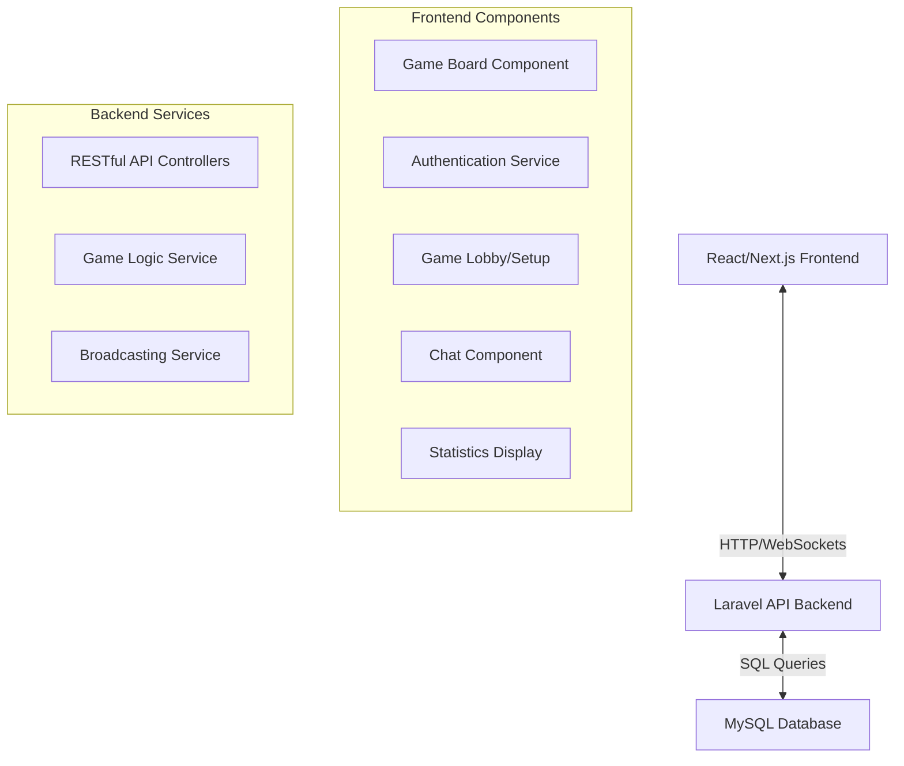
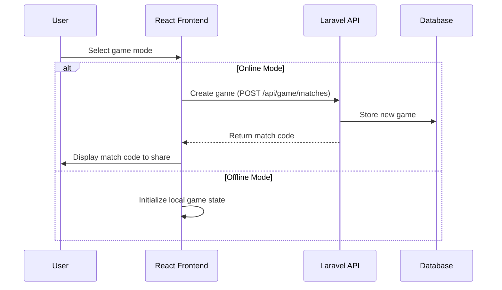
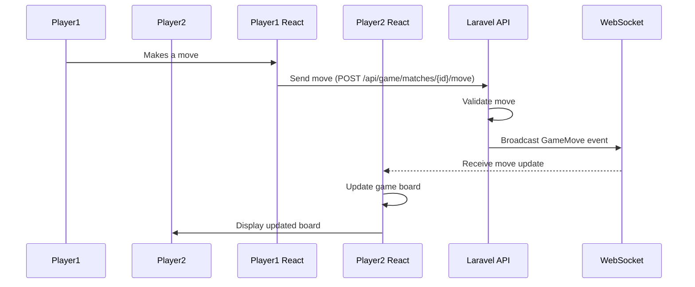

# System Patterns

## Architecture Overview
The Tic Tac Toe game follows a client-server architecture with real-time communication capabilities:

## Key Technical Decisions

### 1. Frontend Framework
- **Decision**: Use React with Next.js (replacing vanilla JavaScript)
- **Rationale**: React's component-based architecture allows for better code organization and reusability, while Next.js provides server-side rendering and simplified routing.

### 2. State Management
- **Decision**: Use React Context API for global state management with local component state where appropriate
- **Rationale**: For a game of this complexity, Context API provides sufficient state management without introducing additional libraries.

### 3. Real-time Communication
- **Decision**: Maintain Laravel Echo/Pusher for WebSocket communication
- **Rationale**: Leveraging the existing Laravel broadcasting system with React integration allows for efficient real-time updates.

### 4. API Architecture
- **Decision**: RESTful API endpoints with Laravel controllers
- **Rationale**: Standard REST patterns provide a consistent interface for the frontend to interact with the backend.

### 5. Database Schema
- **Decision**: Relational database with normalized tables
- **Rationale**: Game data has well-defined relationships that benefit from a structured relational approach.

## Component Relationships

### Frontend Components
- **Game Board**: Core component that displays the game grid and handles player moves
- **Game Mode Selection**: Handles selection between offline and online play
- **Match Creation/Joining**: Manages the creation of new games and joining existing ones
- **Chat System**: Enables real-time communication between players
- **Player Status**: Shows current player turn and game status
- **Statistics Display**: Shows player performance metrics

### Backend Components
- **Authentication Controllers**: Handle user registration, login, and guest access
- **Game Match Controller**: Manages game creation, joining, and state updates
- **Game Logic Service**: Handles game rules, win conditions, and state validation
- **Broadcasting Events**: Manages real-time events for game moves and chat messages

## Data Flow

### Game Initialization Flow

### Online Game Move Flow

## Design Patterns

1. **MVC Pattern**: 
   - Laravel controllers handle API requests
   - React components manage views
   - Laravel models represent data structure

2. **Observer Pattern**:
   - WebSocket events notify components of state changes
   - React components subscribe to state updates

3. **Repository Pattern**:
   - API service modules abstract data fetching in the frontend
   - Laravel models encapsulate database operations

4. **Factory Pattern**:
   - Game state initialization for different game modes
   - Component creation based on game context

5. **Strategy Pattern**:
   - Different game logic for online vs. offline modes
   - Separation of win condition checks from game state management 